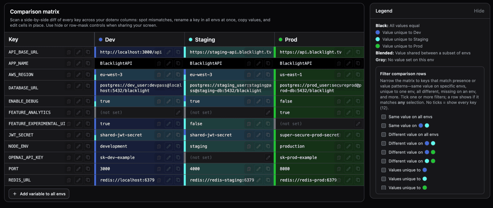
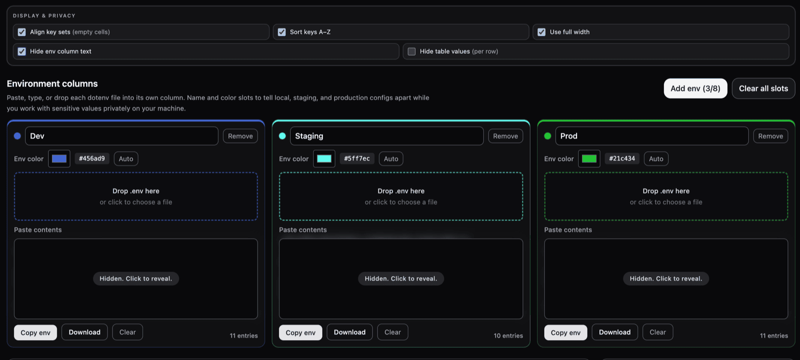
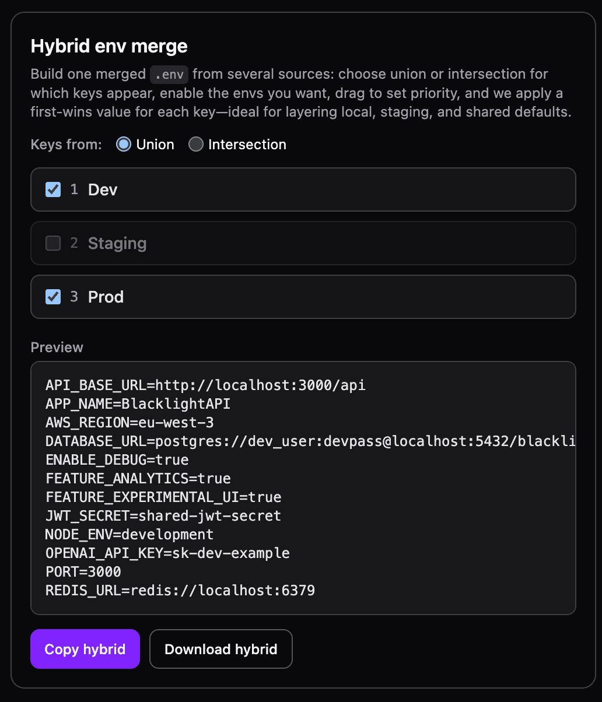
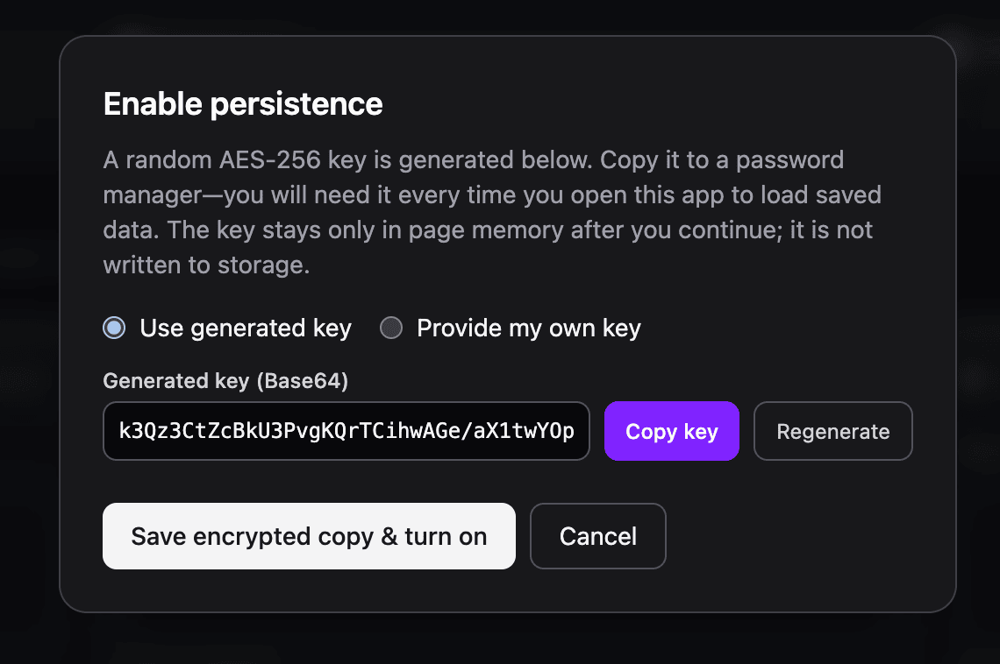

# Ultimate Env Tool — Compare, Diff & Merge `.env` Files in Your Browser

> The open-source dotenv comparison tool: side-by-side diff matrix, hybrid merge with priority, encrypted local persistence with optional idle auto-lock — **100 % client-side, no backend required**.

<p align="center">
  
</p>

Created by **[Eliott Guillaumin](https://eliott.cloud)**.

---

## Why Ultimate Env Tool?

Managing `.env` files across **local**, **staging**, and **production** environments is error-prone. Missing keys, wrong values, and copy-paste mistakes cause outages. Ultimate Env Tool lets you **drop all your dotenv files side-by-side**, instantly spot every mismatch, and build a merged result — entirely in your browser.

---

## Features

### Environment Columns — Drop, Paste, or Type

Paste, type, or drag-and-drop each `.env` file into its own color-coded slot. Name your columns (local, staging, production, …) and compare up to 8 environments at once.

<p align="center">
  
</p>

### Comparison Matrix — Spot Mismatches Instantly

A row-per-key, column-per-env table lets you **edit cells in place**, copy values, and **rename a key across all environments at once**. Color indicators highlight which values match, differ, or are missing. Toggle mask mode when screen-sharing.

### Row Filters (Legend)

Filter the matrix to show only keys that are **identical everywhere**, **unique to one env**, **different across a subset**, or **missing on a specific env** — so you can focus on what matters.

### Hybrid Env Merge — Build Your Ideal `.env`

Choose **union** or **intersection** for which keys appear, toggle sources on/off, drag to set **priority order**, and download a single merged file. **First-defined-wins** per key — perfect for layering local overrides on top of shared defaults.

<p align="center">
  
</p>

### Encrypted Persistence — AES-256-GCM Local Storage

Optionally save an **AES-256-GCM encrypted snapshot** in `localStorage`. The encryption key stays in tab memory only — copy it to your password manager. Export/import **`ultimate-env-tool.encrypted-archive.json`** for backup.

**Automatic idle lock (optional):** When persistence is enabled, you can choose **auto-lock after** **Off**, **1**, **5**, **15**, **30**, or **60 minutes** of inactivity (no pointer, scroll wheel, or keyboard activity). When the timer fires, the app **re-encrypts the current workspace** into `localStorage`, **drops the in-memory key**, clears the on-screen workspace, and shows the **unlock** dialog again — same flow as returning with an encrypted save. Your choice is stored under the browser key **`env-compare.autoLockMinutes`**.

<p align="center">
  
</p>

### Client-Side First — No Account, No Server

Your secrets never leave your machine. No sign-up, no telemetry, no backend calls for editing. Even encrypted persistence is entirely local.

---

## Tech Stack

| Area    | Choice                                |
| ------- | ------------------------------------- |
| UI      | React 19, TypeScript                  |
| Styling | Tailwind CSS v4 (`@tailwindcss/vite`) |
| Build   | Vite 8                                |
| Tests   | Vitest                                |

---

## Requirements

- **Node.js** (LTS recommended) with **npm** (or compatible package manager).

---

## Getting Started

```bash
npm install
npm run dev
```

The dev server defaults to **[http://localhost:5188](http://localhost:5188)** (see `vite.config.ts`).

### Scripts

| Command            | Description                    |
| ------------------ | ------------------------------ |
| `npm run dev`      | Start Vite in development mode |
| `npm run build`    | Typecheck + production build to `dist/` |
| `npm run preview`  | Serve the production build locally |
| `npm test`         | Run Vitest once                |
| `npm run test:watch` | Vitest watch mode          |
| `npm run lint`     | ESLint                         |

---

## Configuration

### `VITE_SITE_URL` (production builds)

For **canonical URLs**, **Open Graph / Twitter** image URLs, **`robots.txt`**, and **`sitemap.xml`**, set the public site origin **without** a trailing slash.

Copy the example file and adjust:

```bash
cp .env.example .env.production
```

Example `.env.production`:

```env
VITE_SITE_URL=https://your-domain.com
```

If unset, the build falls back to `http://localhost:5188` (fine for local previews; **set the real URL before shipping**).

Static SEO assets are emitted into `dist/` on build:

- `robots.txt`
- `sitemap.xml`

Additional head metadata and **JSON-LD** are injected from [`src/seo.ts`](src/seo.ts) via Vite’s `transformIndexHtml`.

### Docker / CapRover

The repo includes **`captain-definition`** at the repo root (CapRover schema v2) pointing at **`./Dockerfile`**, plus a **multi-stage Dockerfile**: Node builds the production `dist/`, then **nginx** serves it on port **80** (CapRover’s default).

1. Create or select an app in CapRover → connect your **Git** repo (or upload tar) so CapRover sees `captain-definition` next to `package.json`.
2. Deploy (CapRover uses **`captain-definition`** automatically; it references the **Dockerfile**). If your dashboard asks for a custom path, use **`./captain-definition`** (default).
3. Under **App Configs → Deployment →** build settings, add a **Build Argument**:
   - **Key:** `VITE_SITE_URL`
   - **Value:** your public URL **without** a trailing slash, e.g. `https://env-tool.captain.example.com`  
     This bakes the correct canonical, Open Graph, and sitemap URLs into the static files.

Local smoke test:

```bash
docker build --build-arg VITE_SITE_URL=https://your-live-domain.example -t ultimate-env-tool .
docker run --rm -p 8080:80 ultimate-env-tool
# open http://localhost:8080
```

Files: [`captain-definition`](captain-definition), [`Dockerfile`](Dockerfile), [`nginx.conf`](nginx.conf), [`.dockerignore`](.dockerignore).

---

## Project Layout

```
├── captain-definition # CapRover: schemaVersion 2 → ./Dockerfile
├── Dockerfile        # Multi-stage: build SPA + nginx runtime
├── nginx.conf        # SPA static hosting + try_files fallback
├── public/           # Static assets (favicon, og-image.png, web manifest)
├── src/
│   ├── components/ # UI: matrix, slots, hybrid builder, legend, dialogs
│   ├── lib/        # Parsing, persistence, download helpers
│   ├── App.tsx     # Main app shell
│   ├── seo.ts      # Site name, descriptions (shared with build-time HTML)
│   └── main.tsx
├── index.html      # HTML shell with SEO placeholders
└── vite.config.ts  # Vite + Tailwind + HTML/robots/sitemap SEO pipeline
```

---

## Security & Privacy

- **Default:** Nothing is uploaded; closing the tab discards in-memory state unless you enabled encrypted persistence.
- **Persistence:** Uses the Web Crypto API (**AES-256-GCM**). The passphrase-derived key is intended to exist only in that tab session; review the in-app disclaimer before enabling.
- **Idle auto-lock:** Reduces how long decrypted contents stay in a warm tab by forcing re-entry of the key after a chosen idle period. Like any SPA, memory hygiene depends on the engine — treat auto-lock as a practical safeguard, not a guarantee against forensic recovery.

---

## License

This project is **copyright © Eliott Guillaumin** and licensed under the **GNU Affero General Public License v3.0** — see [`LICENSE`](LICENSE).

### Using it for free (encouraged)

- Run it locally, self-host it for yourself, or deploy it on **your own infrastructure** for **yourself or your organization** without owing a license fee.
- Change the code and share it under AGPL rules (including network use: AGPL’s “remote interaction” obligations apply when you modify and offer the program over a network — read the full license).

### Paid hosting for other people (restricted)

You **may not** charge third parties for access to a hosted copy of this app (paid SaaS, selling seats to “Ultimate Env Tool as a service”, etc.) **without a separate commercial agreement** with the copyright holder.

That policy is spelled out in **[`LICENSE-NONCOMMERCIAL`](LICENSE-NONCOMMERCIAL)** (supplemental terms). For a commercial license or questions: **[eliott.cloud](https://eliott.cloud)**.

### Summary files

| File | Role |
|------|------|
| [`LICENSE`](LICENSE) | Full **AGPL-3.0** text |
| [`LICENSE-NONCOMMERCIAL`](LICENSE-NONCOMMERCIAL) | Supplemental terms: **no charging others for hosted access** without permission |
| [`NOTICE`](NOTICE) | Copyright and pointers to the above |

*This section is a short overview, not legal advice. If AGPL’s obligations or the supplement affect your product, consult a lawyer.*

The repo may remain **`"private": true` in `package.json`** for Git hosting preference; that flag does not change the license terms in these files.
